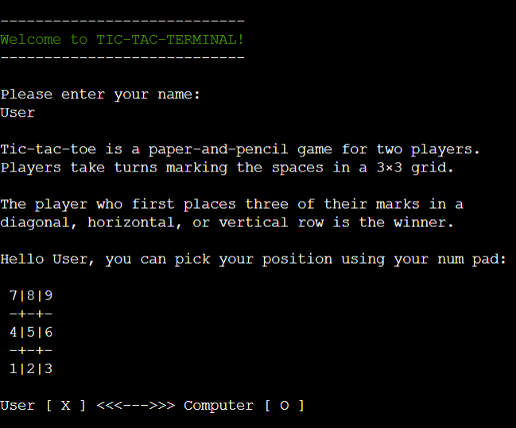
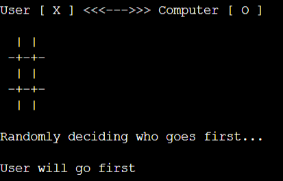
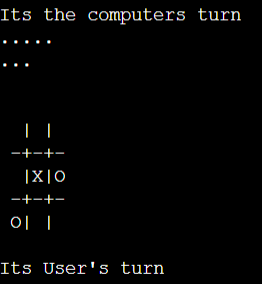
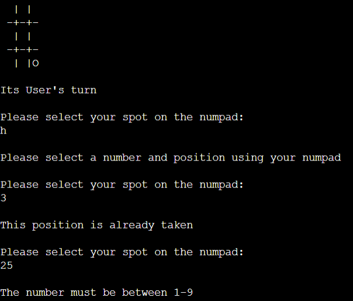
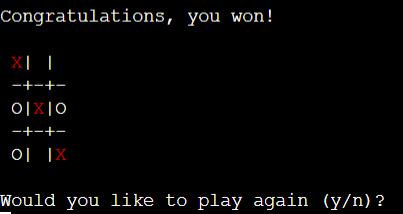
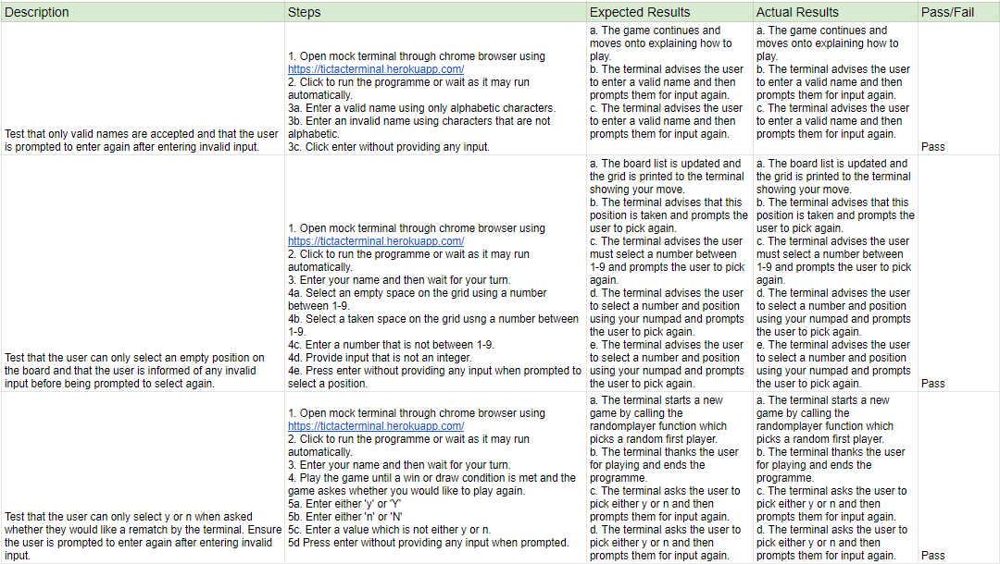

# TIC-TAC-TERMINAL

TIC-TAC-TERMINAL is a Python terminal game which runs in the Code Institue mock terminal on Heroku.

The player can try to beat the computer by taking turns marking the spaces in a 3×3 grid. The player who succeeds in placing three of their marks in a diagonal, horizontal, or vertical row is the winner.

[Click here to view the live project.](https://tictacterminal.herokuapp.com "Heroku App")

## How to play
 
* On your turn you can pick an empty spot on the grid using your num pad.
* The computer will then select an available spot.
* The player who first marks 3 diagonal, horizontal, or vertical spots is the winner.
* If all spots on the board are filled without 3 in a row then the game is a draw.

## Features

### Existing Features

* Random decision on who goes first.
    At the start of each game, the computer randomly decides who goes first using the random module and then calls that player's turn. 

* Ability to play against the computer. The computer uses the random module to randomly select an empty location on the grid. 

* The grid is drawn and updated during each turn. The grid is created using print statements and list indexing. The layout is set to match the standard number pad on a keyboard to easily select a . 

* Askes for user input and validates the user's selection. Input can raise an exception if the user does not enter an integer when selecting a location. The function also checks that the number entered is between 1-9 and not filled. 

* Provides option of a rematch once a game is over. Checks the input to ensure the user is either y or n and requests input again if invalid input is provided. Checks the randomw first player function if y is selected and exits programme if n is selected. 

* Colorama is an API that allows the user to print coloured text in the terminal. This is used to display the winning marks on the board.

### Future Features

* Give option for player v player games
* Give different difficulty options for the computer

### Technologies Used

* Github
  - Github is used to create, store and maintain all codes in a repository.
  - Github is also used as the site hosting service for the final website to be published on.
* Gitpod
  - Gitpod has been used as a local code editor to write and manage all codes and files.
* Python
  - Python is used as the main programming language to creat this project.
* Colorama
  - Provides a cross-platform API to print colored terminal text from Python applications.
* Heroku
  - Heroku is a platform that enables developers to build, run, and operate applications entirely in the cloud.
  
## Testing

I have tested the code by doing the following:

### User Input Testing

* [Passed Python code through the PEP8 checker and confirmed there was no issues.](images/PEP8.PNG)

* Play tested on both the gitpod and Heroku terminal. 

### Bugs

#### Resolved Bugs

* I found that the computers position would not appear on the board sometimes which was due to my error in providing the randint with the range (1, 10). As the second number is inclusive this meant that the computer was to select a position off the board. 

* My Wincheck Def was not updating the winner variable, this was due to my error in not including the global keyword within the function. 

#### Remaining Bugs

* There are no remaining bugs.

### Deployment

This project was deployed using Code Institute's mock terminal for Heroku.

* Steps for deployment:
  - Fork or clone this repository.
  - Create a new Heroku app.
  - Set the buildbacks to Python and NodeJS in that order.
  - Link the Heroku App to the repository.
  - Click on Deploy.

### Making a clone or download zip to run locally

* Log into GitHub account.
* Select repository.
* Select TICTACTOEPROJECT.
* Click on the Code dropdown button next to the green Gitpod button.
* Click on the clipboard icon to copy the clone URL.
* Open Git Bash.
* Change the current working directory to the location where you want the cloned directory.
* Type "git clone" in the Command Line and then paste the URL copied in step 5.
* Press enter to create your local clone.
* Alternately, click on Download ZIP, unpack locally and open with a local code editor.

### Forking the GitHub Repository

* Log into GitHub.
* Select repository.
* Select TICTACTOEPROJECT.
* At the very top right corner click "fork".
* You will have a copy of the original repository in your own GitHub account.

## Credits

* Wikipedia for the information on Tic-Tac-Toe.
* Code institute for the deployment terminal.
* My mentor, Daisy McGirr for her guidance on this project. 