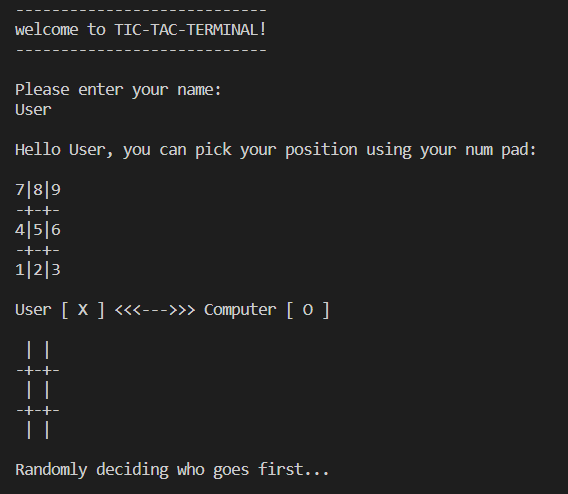
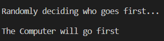
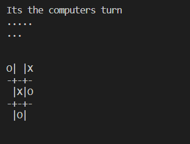
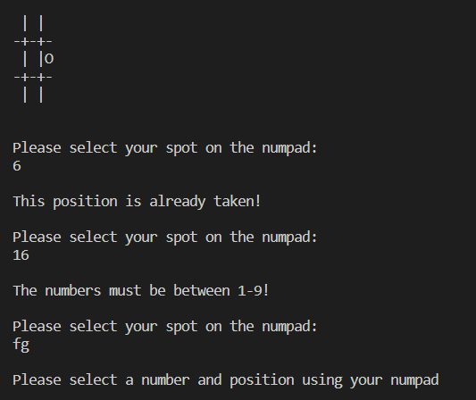
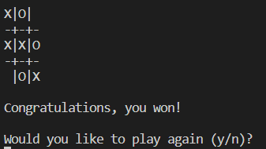

# TIC-TAC-TERMINAL

TIC-TAC-TERMINAL is a Python terminal game which runs in the Code Institue mock terminal on Heroku.

The player can try to beat the computer by taking turns marking the spaces in a 3×3 grid. The player who succeeds in placing three of their marks in a diagonal, horizontal, or vertical row is the winner.

Click here to view the live project.

## How to play
 
* On your turn you can pick an empty spot on the grid using your num pad.
* The computer will then select a spot.
* The player who first marks 3 diagonal, horizontal, or vertical spots is the winner.
* If all spots on the board are filled then the game is a draw.

## Features

### Existing Features

* Random decision on how goes first.
    At the start of each game, the computer randomly decides who goes first and then announces it. 

* Ability to play against the computer.

* The grid is drawn and updated during each turn. 

* Askes for user input

* Validates user input and raises exceptions if not a blank space on the board.

* Option of a rematch once a game is over. 

### Future Features

* Give option for player v player games
* Give different difficulty options for the computer

## Testing

### Bugs

#### Resolved Bugs

* I found that the computers position would not appear on the board sometimes and this was due to me providing the randint with the range (1, 10). As the second number is inclusive this meant that the computer was selecting a position off the board. 

#### Remaining Bugs

* There are no remaining bugs.

#### Validator Testing

## Deployment

## Credits